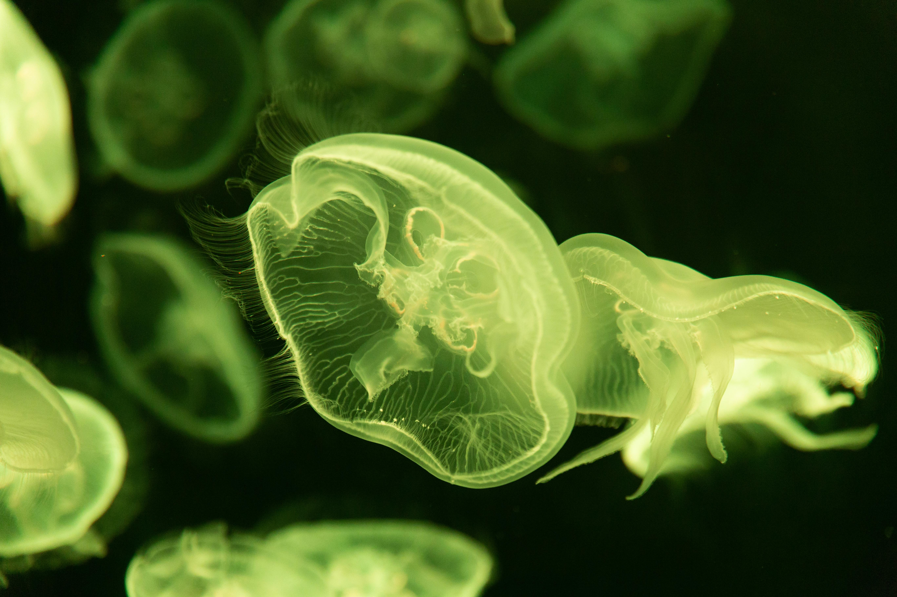
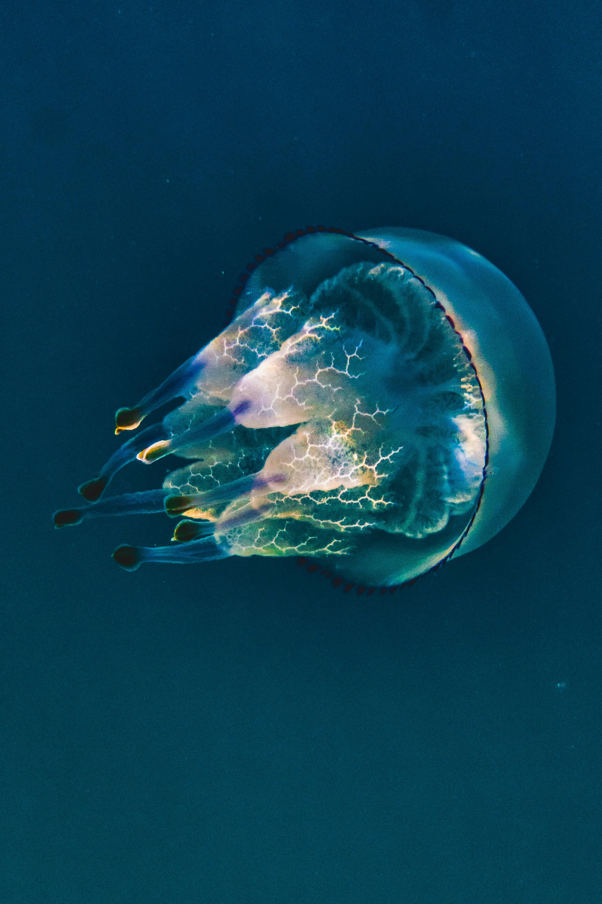
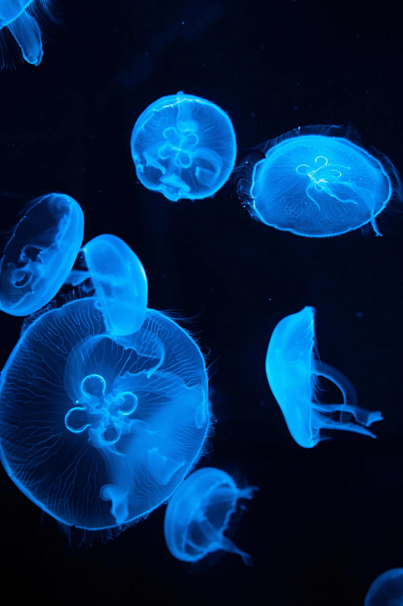

<!DOCTYPE html>
<html lang="zh-Hant">
<head>
  <meta charset="UTF-8" />
  <meta name="viewport" content="width=device-width, initial-scale=1.0"/>
  <title>水母特集</title>
  
</head>
<body class="theme-cute">
  <header>
    <h1 id="main-title">水母的可愛療癒特集</h1>
    
看著柔軟漂浮的水母，放鬆你的心靈。

  </header>

  

    <button onclick="switchTheme('cute')">可愛療癒</button>
    <button onclick="switchTheme('dark')">危險神秘</button>
  

  <main>
    <video controls autoplay loop muted>
      <source src="856882-hd_1920_1080_24fps.mp4" type="video/mp4" />
      您的瀏覽器不支援影片播放。
    </video>

    <section class="gallery">
      
      
      
    </section>
  </main>

  <footer>
    &copy; 2025 水母觀察站｜本網站為學習用途製作
  </footer>

  
</body>
</html>
